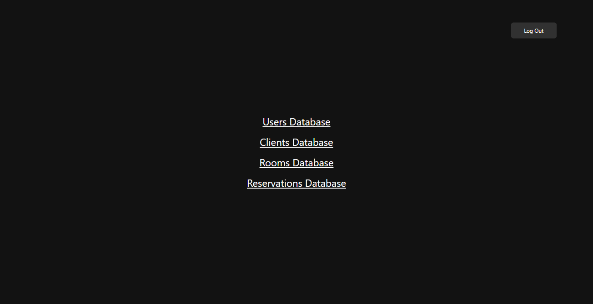

# Hotel-Reservations-Manager

## This app is my project submission for the final exam of [IT Kariera](https://it-kariera.mon.bg/).

## Running the project
`$npm run start`

## Features:
- per role permissions
- accounts system (managed by an admin)
- ability to add new users, clients, reservations and rooms
- edit stuff 
- pagination, searching, filtering and sorting of all data
- reservation price is automatically calculated (no more calculations on paper!)

## Links:
- [assignment](https://docs.google.com/document/d/1Kb8cbh-3S8UdPHhTj4aNlfldotqDfyrVNw7HnTL6IMo/edit?usp=sharing)
- [trello board](https://trello.com/b/mQDsxIQo/hotel-reservations-manager-it-kariera)
- [figma board](https://www.figma.com/file/PM2A9VMzNTJZodFf0DYw9Y/Hotel-Reservations-Manager-Design?node-id=0%3A1)

## Screenshots of the app:
### Login page:

### Database page:

### Menu page:

